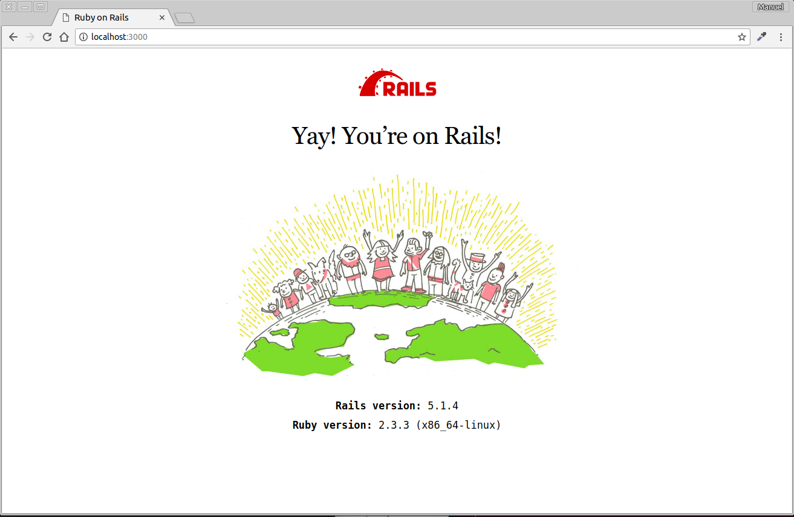

# DOCKER RUBY ON RAILS WIDTH DATABASE MYSQL

Un entorno docker para desarrollo de aplicaciones de Ruby on Rails con base de datos Mysql
- rails version 5.1.4 (se puede cambiar en app/Genfile)

## construir las imagenes de los contenedores rails

    docker-compose build

## arrancar contenedores

    docker-compose up

dejamos corriendo los dos contenedores y abrimos otro terminal

## crear un nuevo proyecto de Rails con mysql

en otro terminal ejecutar los comandos

    docker exec -it --user $UID:$UID drails rails new . -d mysql

nos avisa que el Genfile exite que si queremo reemplazarlo Y

## BASE DE DATOS

Configurar rails para conectar con el docker de mysql

editamos el archivo app/app/config/database.yml

    default: &default
      adapter: mysql2
      encoding: utf8
      pool: <%= ENV.fetch("RAILS_MAX_THREADS") { 5 } %>
      **username: root**
      **password: toor**
      **host: db**
      **port: 3306**

### crear bases de datos

    docker exec -it --user $UID:$UID drails rake db:create

si no funcion crear a mano acceder al contenedor de base de datos y las creamos de forma manual

    docker exec -it dbmy /bin/bash

    mysql -u root -p
    toor

    CREATE DATABASE app_development;
    CREATE DATABASE app_test;

### Arrancar el servidor de rails

    docker exec -it --user $UID:$UID drails rails server

y accedemos en el navegador a la url http://localhost:3000

ya tenemos nuestro rails corriendo!!

para trabajar, siempre tiene que estar corriendo en un terminal el docker-compose y en otro ejecutar los comandos, para no repetir tanto comando de docker usaremos el source

cargamos el script 

    source railsSource

y en este terminal ya no tenemos que poner docker exec -it --user $UID:$UID drails, para ejecutar el servidor:

    rails server

## Algunos comando de Rails

### Mostrar las rutas creadas

    rake routes

### Ejemplos de scaffold

    rails generate scaffold User nombre:string email:string

    rails generate scaffold Post titulo:string contenido:string user_id:integer

## Ejecutar las migraciones

    rake db:migrate
